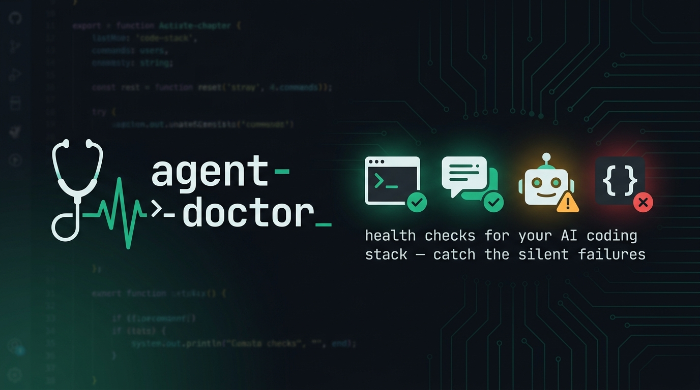
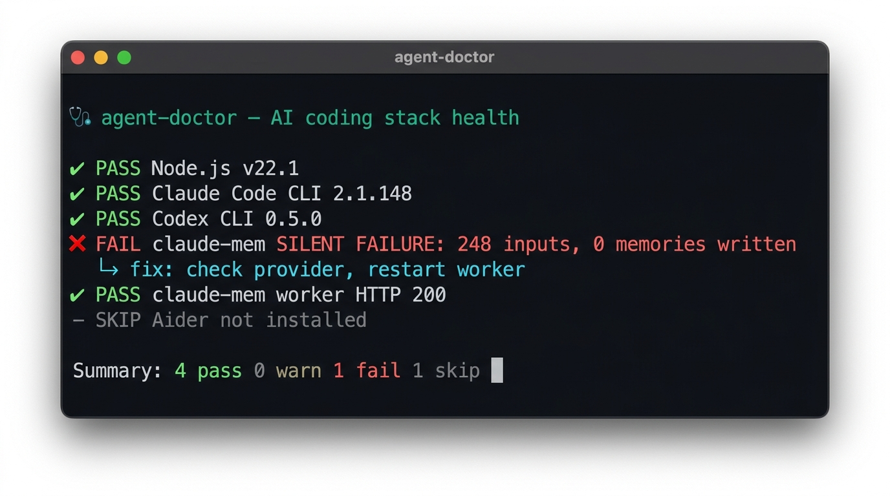

<div align="center">



# 🩺 agent-doctor

**`flutter doctor` for your AI coding stack.**
Diagnose Claude Code, Codex, Cursor, Gemini CLI, Aider & more — and catch the **silent failures** before they waste your day.

[](https://www.npmjs.com/package/ai-agent-doctor)
[](LICENSE)
[](https://github.com/NAJEMWEHBE/agent-doctor/actions)
[](https://github.com/NAJEMWEHBE/agent-doctor)



</div>

---

## The problem

Your AI coding setup is a stack of moving parts — the agent CLI, MCP servers, a memory system, hooks, API keys, runtimes. They **look** installed. But "installed" ≠ "working."

> Real story that started this project: a popular memory plugin logged **235 prompts** and wrote **0 actual memories** for *days*. Everything looked fine. It was silently dead — discovered only by accident.

Nothing tells you when a piece of your stack quietly breaks. **agent-doctor does.**

## What it does

One command runs **functional probes** (not "does the file exist" — *does it actually work*) and prints a clean PASS / WARN / FAIL report with a one-line fix for every problem:

```
  🩺 agent-doctor — AI coding stack health
  Health score: 75/100

  AGENTS
    ✔ PASS  Claude Code CLI        2.1.148
    ✔ PASS  Codex CLI              0.5.0
  MEMORY
    ✖ FAIL  claude-mem (writing?)  SILENT FAILURE: 248 inputs logged, 0 memories written
           ↳ fix: check CLAUDE_MEM_PROVIDER + CLAUDE_CODE_PATH, then restart the worker
    ✔ PASS  claude-mem worker      HTTP 200
  RUNTIME
    – SKIP  Aider                  not installed

  3 pass  0 warn  1 fail  1 skip
  Action needed — see fixes above.
```

That **FAIL** line is the whole point: it surfaces the silent failure instantly instead of days later.

### Why not just a config linter?

Other "health" tools audit your *config* (`settings.json`, `CLAUDE.md` best practices) — useful, but they can't see a tool that's **installed and configured yet silently broken**. agent-doctor runs **live runtime probes**: it asks *"is the memory actually writing? is the worker answering? does the CLI run?"* — and reports a 0–100 score across dimensions. **They audit your config; agent-doctor checks if your stack is actually alive.** (See [docs/LANDSCAPE.md](docs/LANDSCAPE.md).)

### Suggest & fix (research-backed)

In a research-capable agent (Claude Code, etc.), after the report you can opt in to **fix** the failures, not just see them: for each FAIL the agent deep-researches a real, **source-cited** solution, shows it with a risk note, and applies it **only if you approve** — then re-runs that one check (`--only <id> --force`) to confirm it went green. Never auto-applies; never invents a fix. A bare `npx agent-doctor` run still shows the static one-line hint.

## Install

**Try it instantly (no install):**
```bash
npx ai-agent-doctor
```

**Install globally:**
```bash
npm install -g ai-agent-doctor
agent-doctor --deep
```
> npm package is **`ai-agent-doctor`** (the plain name was taken); the installed command is still **`agent-doctor`**.

**Claude Code (auto-runs every session + adds `/doctor`):**
```
/plugin marketplace add NAJEMWEHBE/agent-doctor
/plugin install agent-doctor@agent-doctor
```
Then just type `/doctor` anytime, or let the session-start hook flag problems automatically.

## Supported agents & tools

| Agent / tool | Checked |
|---|---|
| Claude Code | CLI alive · settings valid · **memory writing (silent-failure detector)** · worker · MCP |
| Codex CLI | CLI alive |
| Cursor | CLI alive |
| Gemini CLI | CLI alive |
| Aider | CLI alive |
| GitHub Copilot CLI | CLI alive |
| opencode | CLI alive |
| Qwen Code | CLI alive |
| Block Goose | CLI alive |
| Charm Crush | CLI alive |
| Continue CLI | CLI alive |
| Augment Auggie | CLI alive |
| Sourcegraph Cody | CLI alive |
| MCP servers | reachability of configured servers (remote url + local launcher command) |
| API keys | live ping — Anthropic · OpenAI · Gemini · Groq (skipped unless the key env var is set; never printed) |
| Runtimes | Node · Bun · Python · git |
| Any shell / CI | `--json`, `--fail-on fail` |

Absent tools are **skipped**, never failed — only *installed-but-broken* things fail.

## Usage

```bash
agent-doctor              # full report (default --deep)
agent-doctor --fast       # quick, no network (used by the session-start hook)
agent-doctor --json       # machine-readable, for CI/automation
agent-doctor --fail-on fail   # exit nonzero if anything is broken (CI gate)
agent-doctor --quiet      # only show problems
agent-doctor --force      # ignore throttle cache, re-run network probes now
agent-doctor init         # write a starter checks.json you can extend
```

## Add your own checks

Checks are **data**, not code. Drop a `checks.json` in your project or `~/.agent-doctor/checks.json` — it merges over the built-ins by `id`:

```json
{
  "checks": [
    {
      "id": "keys:openai",
      "label": "OpenAI API key",
      "tier": "deep",
      "throttleHours": 24,
      "probe": { "type": "http", "url": "https://api.openai.com/v1/models", "expectStatus": 200, "headers": { "Authorization": "Bearer YOUR_KEY" } },
      "fix": "Set/rotate OPENAI_API_KEY"
    }
  ]
}
```

Probe types: `exec` (judge by output, tolerates weird exit codes), `http`, `port`, `fileJson`, `memwrite` (the silent-failure detector). PRs adding checks for new tools are welcome — it's usually ~10 lines.

## How it stays fast & honest

- **Two tiers** — `--fast` (no network: configs, processes, DB deltas) auto-runs at session start; `--deep` (version spawns, API pings) on demand. Deep network probes are **throttled/cached**.
- **Judge by output, not exit code** — some binaries exit nonzero on Windows yet ran fine; a probe passes if the expected output appears.
- **Never blocks** — the session hook always exits 0. Use `--fail-on` only when you *want* a CI gate.

## Contributing

Issues + PRs welcome. The easiest contribution: **add a check for a tool you use** (see [Add your own checks](#add-your-own-checks)). Good first issues are tagged `add-a-check`.

## License

[MIT](LICENSE) — free forever. If agent-doctor saved you a debugging session, a ⭐ helps others find it.
